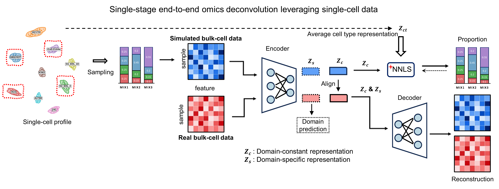

# DECIPHER

**DECIPHER integrates disentangled representation learning and
prototype-based cell-type deconvolution across molecular modalities.**

## Overview

DECIPHER integrates disentangled representation learning and
prototype-based cell-type deconvolution across molecular modalities. Given a
single-cell reference, it learns decoupled latents --- a domain-constant
representation (`Zc`) and a sample-specific representation (`Zs`) --- and
estimates cell-type proportions via prototype-guided non-negative least
squares using cell-type latent prototypes (`Zct`). The same framework
applies across modalities such as RNA-seq, ATAC-seq, and spatial
transcriptomics.

## Model framework



## Installation

```bash
git clone https://github.com/aapupu/DECIPHER.git
cd DECIPHER
conda env create -f environment.yml
conda activate decipher
pip install -e .
```

GPU is used automatically when CUDA is available.

## Input

- **Single-cell reference** (`.h5ad`): required cell-type labels
  (e.g. `obs["celltype"]` / `obs["cell_line"]`).
- **Real mixtures**: sample × gene matrix (or gene × sample CSV / `.h5ad`)
  aligned to the same genes as the reference after processing.

## Usage

### 1. Python API

```python
from DECIPHER import (
    DECIPHER,
    DecodePseudoBulkBuilder,
    DecodePseudoBulkConfig,
    LossWeights,
    PseudoRealDynamicPairDataset,
    pair_collate,
    process_adata,
    reorder_celltype_proportions,
    row_max_normalize,
    seed_everything,
)
```

Minimal training example:

```python
import numpy as np
import scanpy as sc
import torch
from sklearn.decomposition import PCA
from torch.utils.data import DataLoader

from DECIPHER import (
    DECIPHER, DecodePseudoBulkBuilder, DecodePseudoBulkConfig, LossWeights,
    PseudoRealDynamicPairDataset, pair_collate, process_adata,
    reorder_celltype_proportions, row_max_normalize, seed_everything,
)

seed_everything(42)
device = "cuda" if torch.cuda.is_available() else "cpu"

adata = sc.read_h5ad("sc_reference.h5ad")
celltype_order = list(dict.fromkeys(adata.obs["celltype"].astype(str)))
sc_data = process_adata(adata, celltype_key="celltype", state_key=None)

X = np.asarray(sc_data.X, dtype=np.float32)
Z = PCA(n_components=16, random_state=42).fit_transform(X)
labels = adata.obs["celltype"].astype(str).to_numpy()
s_z = torch.from_numpy(
    np.stack([Z[labels == ct].mean(0) for ct in celltype_order]).astype(np.float32)
)

builder = DecodePseudoBulkBuilder(
    sc_data, DecodePseudoBulkConfig(cells_per_bulk=50, seed=42), require_state=False,
)
pseudo_x, pseudo_prop = [], []
for _ in range(2000):
    x, p, _ = builder.build_one()
    pseudo_x.append(x)
    pseudo_prop.append(reorder_celltype_proportions(p, sc_data.celltype_map, celltype_order))
pseudo_x = row_max_normalize(np.stack(pseudo_x))
pseudo_prop = np.stack(pseudo_prop).astype(np.float32)

# replace real_x with your bulk / spatial mixtures
real_x = pseudo_x[:200].copy()
real_domain = np.ones(len(real_x), dtype=np.int64)

train_ds = PseudoRealDynamicPairDataset(
    pseudo_x, pseudo_prop, real_x, real_domain, seed=42,
)
train_loader = DataLoader(train_ds, batch_size=128, shuffle=True, collate_fn=pair_collate)

model = DECIPHER(
    s_z=s_z, n_feature=pseudo_x.shape[1], hidden_dim=(128, 128), n_domain=2,
).to(device)
model.fit(
    train_loader, lr=1e-4, weight_decay=1e-3, max_epoch=300, device=device,
    patience=10,
    loss_weight=LossWeights(
        w_prop=100, w_rec=0.1, w_latrec=0.1, w_dom=0.2,
        w_align=0.3, w_contrast=0.1, mse_ce_ratio=20,
    ),
    outdir="DECIPHER.pt", verbose=True,
)

_, proportions = model.deconvolution(torch.from_numpy(real_x).to(device))
```

Demo notebook: [`citeseq.ipynb`](citeseq.ipynb).

### 2. Command line

After `pip install -e .`:

```bash
DECIPHER \
  --sc_path sc_reference.h5ad \
  --bulk_path bulk_matrix.csv \
  --celltype_key celltype \
  --outdir DECIPHER_out \
  --n_pseudo 4000 \
  --max_epoch 300 \
  --real_mixup_prob 0.2 \
  --verbose
```

Writes `DECIPHER_out/DECIPHER.pt` and `DECIPHER_out/pred_proportions.csv`.

### Core functions

#### `process_adata`

```python
process_adata(adata, celltype_key="celltype", state_key=None)
```

#### `DECIPHER`

```python
DECIPHER(s_z, n_feature=2000, hidden_dim=(128, 128), n_domain=2,
         drop_prob=0.1, align_dim=32)
```

#### `model.fit` / `model.deconvolution`

```python
model.fit(train_loader, val_dataloader=None, lr=1e-4, weight_decay=1e-3,
          max_epoch=500, device="cuda", patience=10, loss_weight=LossWeights(),
          outdir="DECIPHER.pt", verbose=False)
pi, proportions = model.deconvolution(x)   # optional ct_mask=...
z_c, z_s = model.encode_z(x)
```

### Hyperparameters

| Parameter | Default | Meaning |
| --- | --- | --- |
| `lr` | `1e-4` | AdamW learning rate |
| `weight_decay` | `1e-3` | L2 regularization |
| `batch_size` | `128` | DataLoader batch size |
| `max_epoch` | `300`--`500` | Maximum epochs |
| `patience` | `10` | Early stopping patience |
| `hidden_dim` | `(128, 128)` | Encoder hidden sizes |
| `align_dim` | `32` | Shared latent dimension |

| `LossWeights` | Default | Role |
| --- | --- | --- |
| `w_prop` | `100` | Proportion supervision on pseudo |
| `w_rec` | `0.1` | Expression reconstruction |
| `w_latrec` | `0.1` | Latent reconstruction (`Zc` ↔ `π Zct`) |
| `w_dom` | `0.2` | Domain classification on `Zs` |
| `w_align` | `0.3` | Domain alignment |
| `w_contrast` | `0.1` | Contrastive term |
| `mse_ce_ratio` | `20` | Balance MSE vs CE inside proportion loss |

## Output

- Training checkpoint: `DECIPHER.pt` (best validation loss)
- `deconvolution(x)` → `(pi, proportions)` --- prototype weights and
  cell-type fractions
- `encode_z(x)` → `(z_c, z_s)` --- decoupled latents

## Mixup

`DECIPHER.mixup` (also exported as `PseudoRealDynamicPairDataset`) supports
**real-mixture mixup**. During training, with probability `real_mixup_prob`,
the loader samples `k` real mixtures and combines them with
Dirichlet(`alpha`) weights (default `p=0.2`, `k=4`, `α=0.5`). Validation
should use `real_sampling="fixed_cycle"` and `real_mixup_prob=0`.

```python
from DECIPHER import PseudoRealDynamicPairDataset, pair_collate

train_ds = PseudoRealDynamicPairDataset(
    X_pseudo, props_pseudo, bulk_X, domain_id, seed=41,
    bulk_ct_mask=bulk_ct_mask,
    real_mixup_prob=0.2, real_mixup_k=4, real_mixup_alpha=0.5,
    real_mixup_mode="dirichlet", real_sampling="random",
)
```

## Citation

DECIPHER integrates disentangled representation learning and
prototype-based cell-type deconvolution across molecular modalities\
Wenpu Lai, Chenyang Li, Oscar Junhong Luo

## Contact

- Wenpu Lai --- kyzy850520@163.com
- Chenyang Li --- eden96211@gmail.com

## Web

Welcome to try our online website:
<https://luo-sysbiomed.cn/models/DECIPHER>
